# Sprint 2 – Evaluación de Seguridad Web 

**Autor:** Bruce Andres Cipriano Chumbes  
**Curso:** Anti-Hacking y Nuevas Tendencias de Seguridad – UPC  
**Entorno:** Kali Linux (VirtualBox)  
**Fecha:** Octubre 2025

---

> Repositorio: evidencia y scripts del Sprint 2.  
> Contenido: comandos ejecutados, outputs relevantes y reportes guardados en `~/evidencias/sprint2/`.

---

## Índice

- [Sprint 2 – Evaluación de Seguridad Web](#sprint-2--evaluación-de-seguridad-web)
  - [Índice](#índice)
  - [0) Preparar entorno](#0-preparar-entorno)
  - [](#)
  - [1) Evidencia inicial](#1-evidencia-inicial)
  - [](#-1)
  - [2) Estructura de targets](#2-estructura-de-targets)
  - [](#-2)
  - [3) Reconocimiento Pasivo (OSINT)](#3-reconocimiento-pasivo-osint)
  - [](#-3)
  - [4) Escaneo de red (Nmap) — perfil conservador](#4-escaneo-de-red-nmap--perfil-conservador)
  - [](#-4)
  - [5) Enumeración Web (WhatWeb / Gobuster / Nikto)](#5-enumeración-web-whatweb--gobuster--nikto)
  - [](#-5)
  - [6) DAST Ligero — OWASP ZAP (baseline / passive)](#6-dast-ligero--owasp-zap-baseline--passive)
    - [Opción GUI (pasos)](#opción-gui-pasos)
  - [7) Mapeo automatizado — Nessus (opcional, si tienes licencia)](#7-mapeo-automatizado--nessus-opcional-si-tienes-licencia)
  - [](#-6)
  - [8) Consolidación de Hallazgos — `3.2.3_results.csv`](#8-consolidación-de-hallazgos--323_resultscsv)
    - [Guía rápida para llenar filas](#guía-rápida-para-llenar-filas)
  - [9) Capturas y organización final de evidencias](#9-capturas-y-organización-final-de-evidencias)
  - [10) Empaquetado final](#10-empaquetado-final)
  - [11) Subir documentación al repositorio (GitHub)](#11-subir-documentación-al-repositorio-github)
---

## 0) Preparar entorno

Ejecutado como usuario normal (`kali`). Comandos usados para preparar el workspace:

```bash
WORKDIR=~/evidencias/sprint2
mkdir -p "$WORKDIR"/targets
mkdir -p ~/evidencias/screenshots
sudo chown -R $USER:$USER ~/evidencias || true

sudo apt update --allow-releaseinfo-change || sudo apt update --fix-missing
sudo apt install -y nmap whatweb gobuster nikto theharvester ffuf dos2unix zip jq
```

Archivo de evidencia básico: `~/evidencias/prep_evidence.txt` (hostname, ip, kernel).

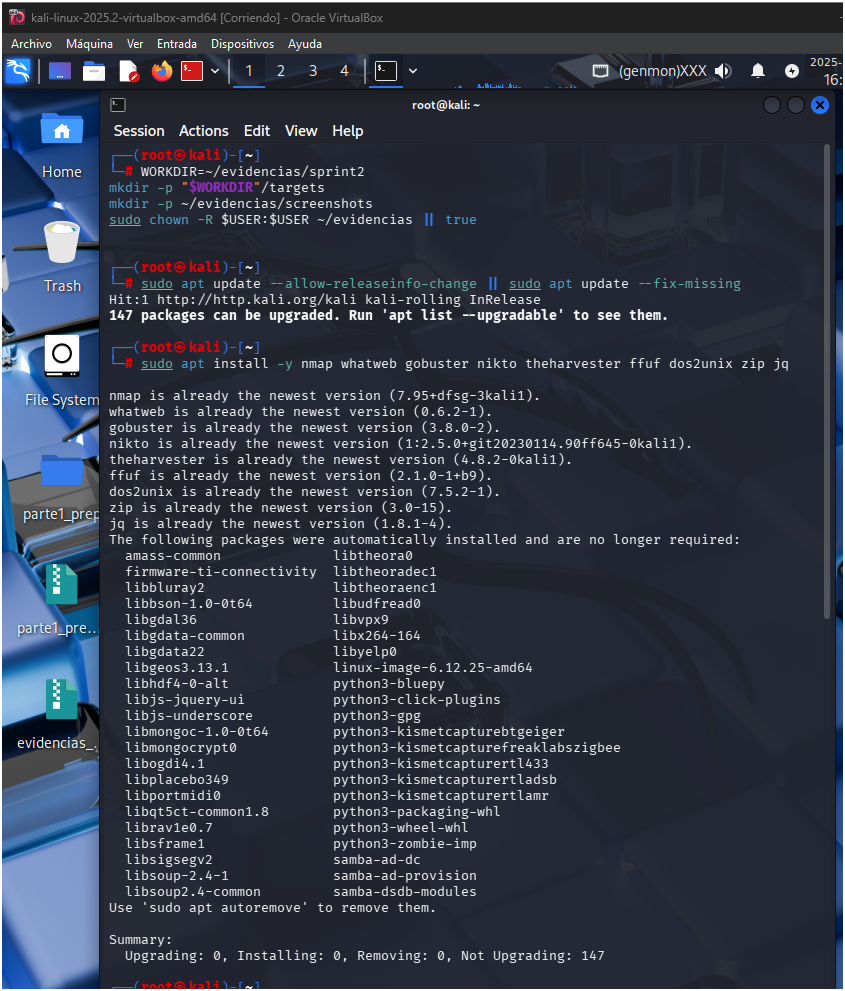
---

## 1) Evidencia inicial

Generado con:

```bash
echo "=== prep evidence: $(date) ===" > ~/evidencias/prep_evidence.txt
hostname >> ~/evidencias/prep_evidence.txt
ip a >> ~/evidencias/prep_evidence.txt
uname -a >> ~/evidencias/prep_evidence.txt
sed -n '1,200p' ~/evidencias/prep_evidence.txt
```

Capturas: `~/evidencias/screenshots/` (guarda PNGs del entorno, terminal, ZAP, Nessus, etc.)
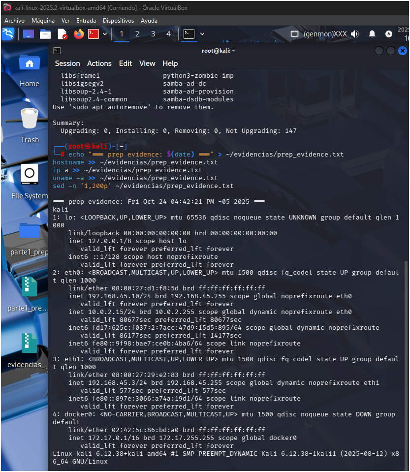
---

## 2) Estructura de targets

Carpetas creadas:

```bash
targets=(puntodepartidauc triphasik raymi virtuolabs)
mkdir -p ~/evidencias/sprint2/targets
for t in "${targets[@]}"; do mkdir -p ~/evidencias/sprint2/targets/$t; done
```

Mapeo (nombre → URL):

* `puntodepartidauc` → `https://www.puntodepartidauc.com`
* `triphasik` → `https://app.triphasikperformance.com`
* `raymi` → `https://raymifest.com`
* `virtuolabs` → `https://www.virtuolabs.dev`


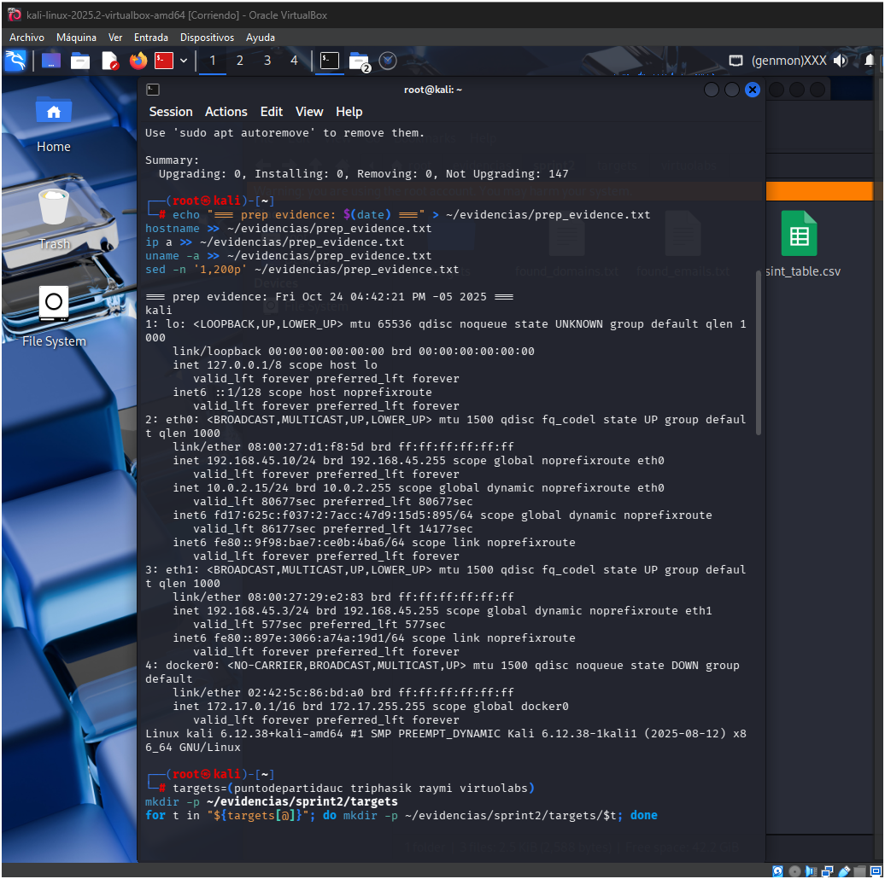
---

## 3) Reconocimiento Pasivo (OSINT)

Comandos ejecutados (ejemplo, Google + urlscan):

```bash
theHarvester -d puntodepartidauc.com -b google -l 200 > ~/evidencias/sprint2/targets/puntodepartidauc/theharvester_google.txt 2>&1
theHarvester -d puntodepartidauc.com -b urlscan -l 200 > ~/evidencias/sprint2/targets/puntodepartidauc/theharvester_urlscan.txt 2>&1
# repetir para cada target (triphasik, raymi, virtuolabs)
```

Extraer correos y dominios (ejemplo):

```bash
grep -E -o "[A-Za-z0-9._%+-]+@[A-Za-z0-9.-]+\.[A-Za-z]{2,6}" ~/evidencias/sprint2/targets/*/theharvester_*.txt | sort -u > ~/evidencias/sprint2/found_emails.txt
grep -Eo "([a-z0-9\-]+\.)+[a-z]{2,}" ~/evidencias/sprint2/targets/*/theharvester_*.txt | sort -u > ~/evidencias/sprint2/found_domains.txt
```

Plantilla CSV OSINT:

```bash
cat > ~/evidencias/sprint2/osint_table.csv <<'CSV'
dominio,subdominio,email,endpoint_api,pdf_file,pdf_author,pdf_version,source,timestamp,evidence_file
CSV
```

Registra manualmente entradas útiles en `osint_table.csv`.
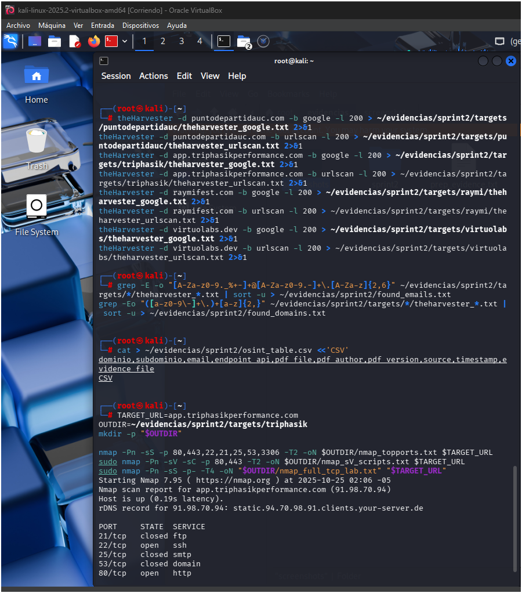
---

## 4) Escaneo de red (Nmap) — perfil conservador

**Regla:** `-T2` para hosts públicos (no agresivo). No usar `-p-` en producción sin autorización.

Ejemplo para `triphasik`:

```bash
TARGET_URL=app.triphasikperformance.com
OUTDIR=~/evidencias/sprint2/targets/triphasik
mkdir -p "$OUTDIR"

nmap -Pn -sS -p 80,443,22,21,25,53,3306 -T2 -oN "$OUTDIR/nmap_topports.txt" "$TARGET_URL"
sudo nmap -Pn -sV -sC -p 80,443 -T2 -oN "$OUTDIR/nmap_sV_scripts.txt" "$TARGET_URL"
# Full TCP (solo en laboratorio / autorizado):
# sudo nmap -Pn -sS -p- -T4 -oN "$OUTDIR/nmap_full_tcp_lab.txt" "$TARGET_URL"
```

Archivos de salida: `nmap_topports.txt`, `nmap_sV_scripts.txt`, (opcional) `nmap_full_tcp_lab.txt`.
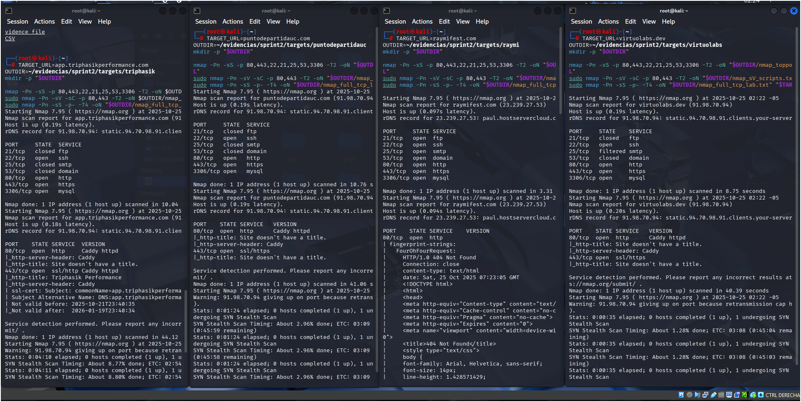
---

## 5) Enumeración Web (WhatWeb / Gobuster / Nikto)

Ejemplo (triphasik):

```bash
TARGET=https://app.triphasikperformance.com
OUTDIR=~/evidencias/sprint2/targets/triphasik
mkdir -p "$OUTDIR"

whatweb -v -a 3 "$TARGET" > "$OUTDIR/whatweb.txt" 2>&1
gobuster dir -u "$TARGET" -w /usr/share/wordlists/dirb/common.txt -s "200,204,301,302,307,401,403" -o "$OUTDIR/gobuster.txt" -k
nikto -h "$TARGET" -output "$OUTDIR/nikto.txt"
```

Repetir para `puntodepartidauc`, `raymifest`, `virtuolabs` (ajustar `TARGET` y `OUTDIR`).

Evidencias: `whatweb.txt`, `gobuster.txt`, `nikto.txt` en cada carpeta target.

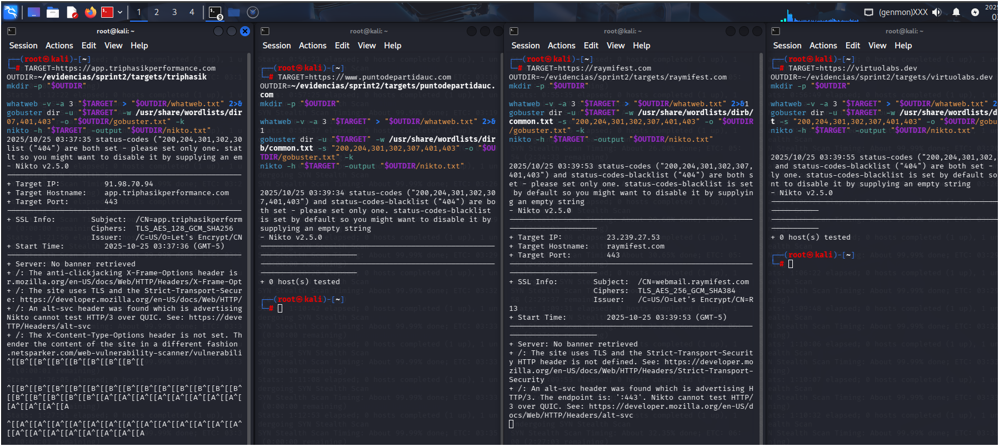
---

## 6) DAST Ligero — OWASP ZAP (baseline / passive)

Modo: **Passive Scan only** (no intrusión). Uso de ZAP GUI o headless.

### Opción GUI (pasos)

1. Abrir ZAP: `sudo owasp-zap` o desde menú.
2. Quick Start → Automated Scan → URL → seleccionar `Passive Scan only` → Attack.
3. Esperar alertas → Report → Generate Report → guardar en:

   ```
   ~/evidencias/sprint2/targets/<target>/ZAP_report.html
   ```

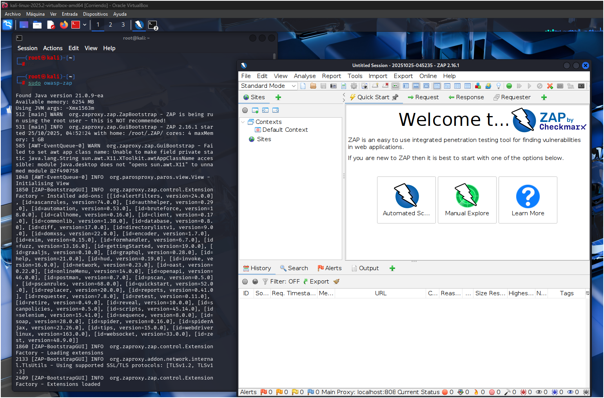

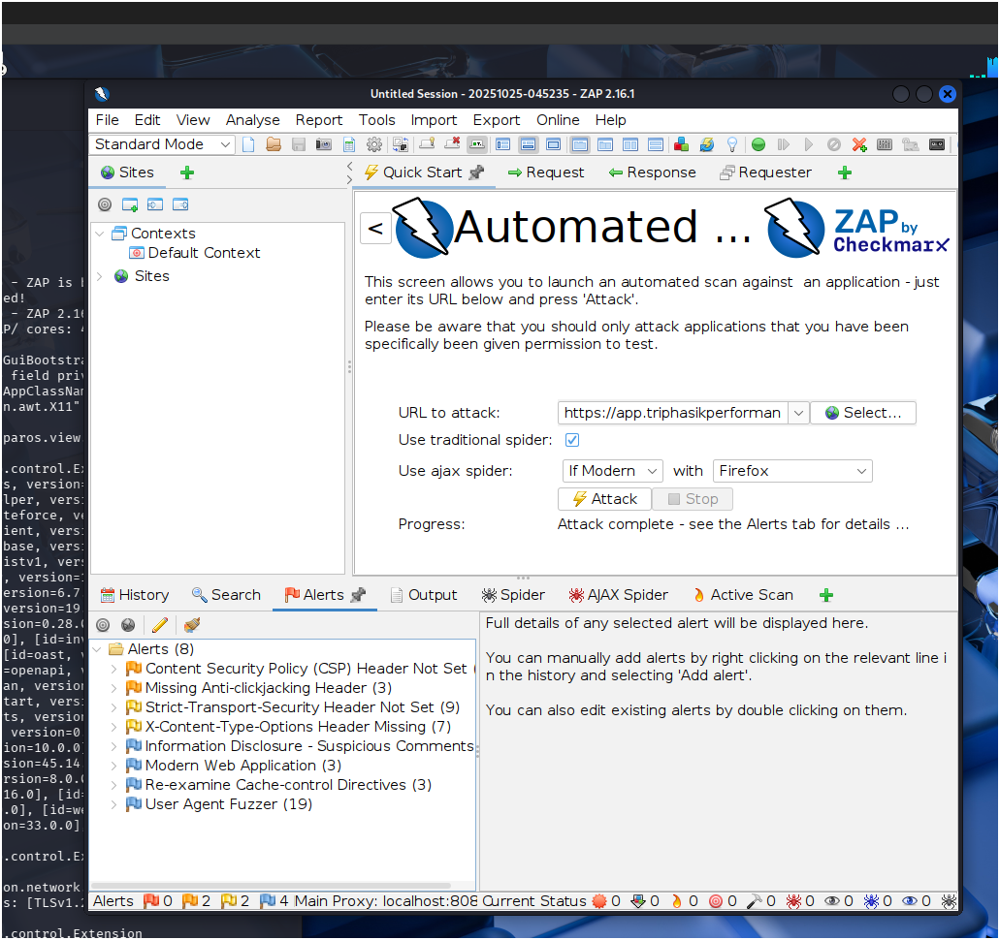

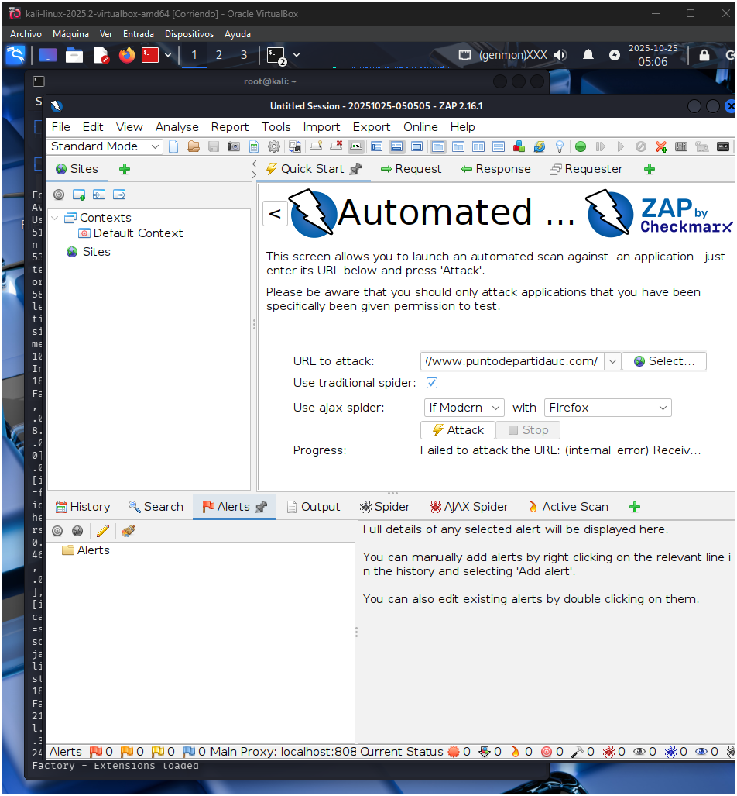

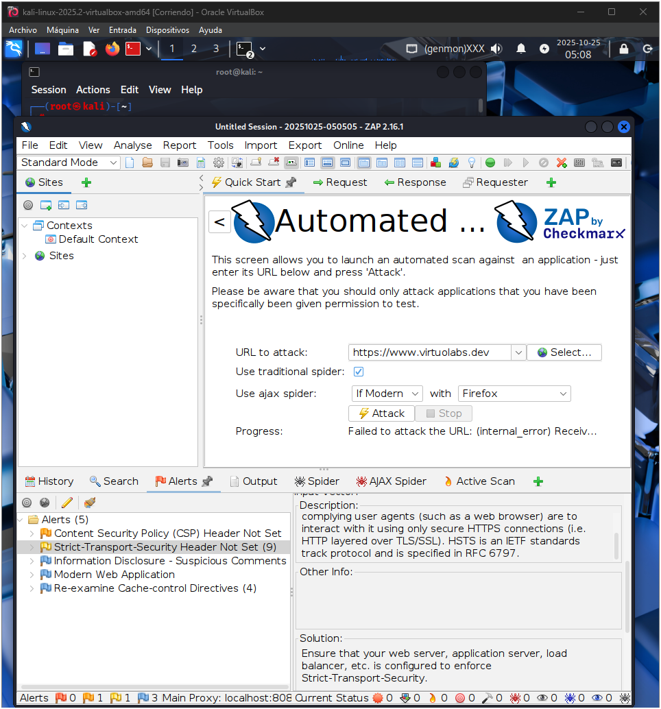

## 7) Mapeo automatizado — Nessus (opcional, si tienes licencia)

> AVISO: Nessus es ruidoso. Ejecutar solo con autorización.

Pasos (UI):

1. `sudo systemctl start nessusd`
2. Abrir `https://localhost:8834/` → crear `Basic Network Scan` o `Web Application Scan` según objetivo.
3. **Targets**: usar solo hostnames (sin `http://` ni rutas):

   ```
   app.triphasikperformance.com
   puntodepartidauc.com
   raymifest.com
   virtuolabs.dev
   ```
4. Ejecutar scan → Exportar PDF → guardar en:

   ```
   ~/evidencias/sprint2/targets/<target>/<target>_Nessus_Report.pdf
   ```

Si no puedes exportar PDF, exporta XML/CSV y toma capturas.

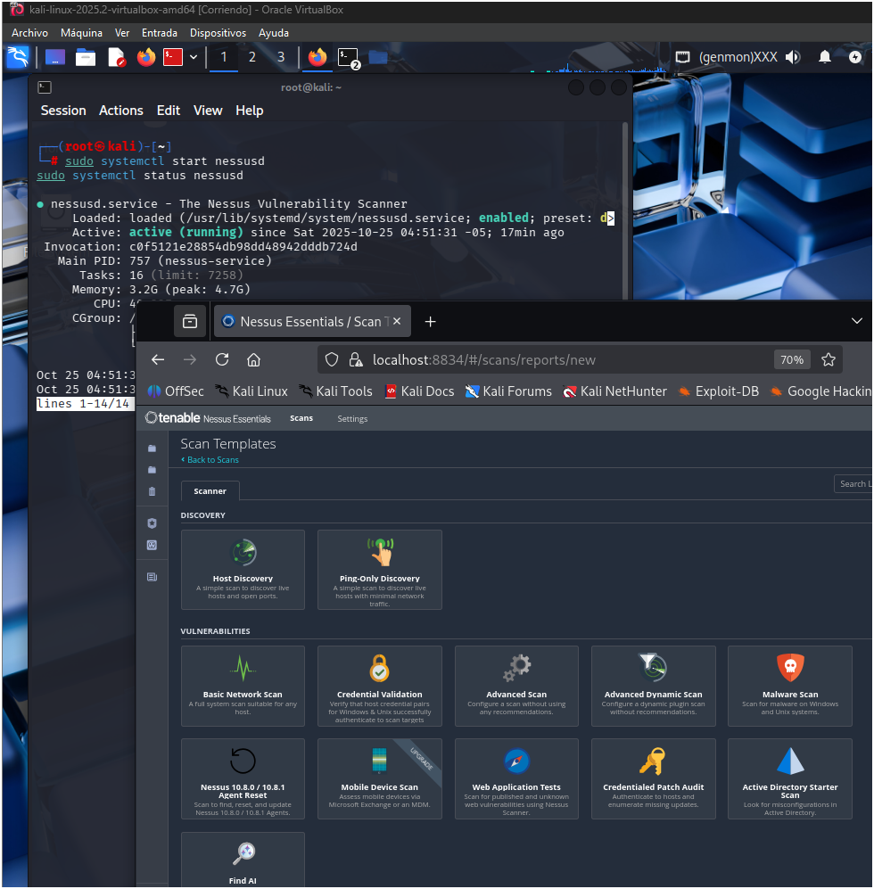

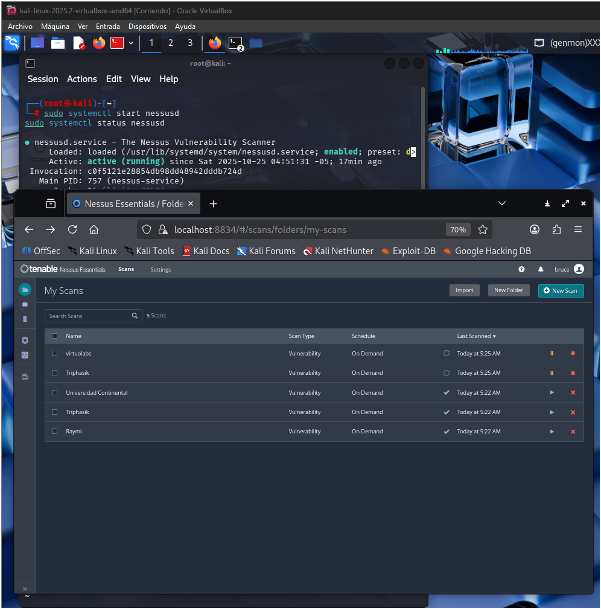
---

## 8) Consolidación de Hallazgos — `3.2.3_results.csv`

Plantilla (creada):

```bash
cat > ~/evidencias/sprint2/3.2.3_results.csv <<'CSV'
ID,Vulnerabilidad,Descripción técnica,Herramienta usada,Severidad (CVSS v3.1 estimado),Impacto potencial,Recomendación (inmediata),Evidencia
CSV
```

Ejemplo de inserción (muestra):

```bash
echo '1,Missing HSTS header,No Strict-Transport-Security header present in responses,whatweb/nikto,4.3,Man-in-the-middle risk for HTTP downgrade,Add HSTS header (Strict-Transport-Security: max-age=31536000; includeSubDomains; preload),~/evidencias/sprint2/targets/triphasik/whatweb.txt' >> ~/evidencias/sprint2/3.2.3_results.csv
```

### Guía rápida para llenar filas

* **ID** incremental.
* **Vulnerabilidad**: título corto.
* **Descripción técnica**: qué y cómo (evidencia técnica).
* **Herramienta usada**: e.g., nmap, nikto, ZAP.
* **Severidad (CVSS)**: estimación (9–10 crítico, 7–8.9 alto, 4–6.9 medio, <4 bajo).
* **Impacto potencial**: resumen.
* **Recomendación (inmediata)**: acción concreta.
* **Evidencia**: ruta absoluta al archivo que demuestra el hallazgo.

---

## 9) Capturas y organización final de evidencias

Ver listado final (comando):

```bash
find ~/evidencias/sprint2 -maxdepth 3 -type f -printf "%P\n" | sed -n '1,200p'
```

Asegurar permisos:

```bash
sudo chown -R $USER:$USER ~/evidencias/sprint2
```

Capturas sugeridas (guardar en `~/evidencias/screenshots/`):

* `prep_env.png` (terminal con prep_evidence.txt)
* `nmap_target.png`
* `nikto_alerts.png`
* `zap_alerts_<target>.png`
* `nessus_overview.png` (si aplica)

---

## 10) Empaquetado final

```bash
cd ~
zip -r ~/Desktop/sprint2_evidences_$(date +%Y%m%d_%H%M).zip evidencias/sprint2
ls -lah ~/Desktop | grep sprint2_evidences_
```

Archivo final entregable: `~/Desktop/sprint2_evidences_<timestamp>.zip`

---

## 11) Subir documentación al repositorio (GitHub)

Ubica tu repo/clon en la VM y crea `README.md` (este archivo). Ejemplo:

```bash
# Asume que tu repo está en ~/Documentos/sprint2/ o similar
cd ~/Documentos/sprint2 || cd /ruta/a/tu/repositorio
# crear archivo README.md con este contenido
nano README.md   # pegar todo lo anterior
git add README.md
git commit -m "Sprint 2 - Documentación de pruebas y evidencias (Bruce Cipriano)"
git push origin main
```


---